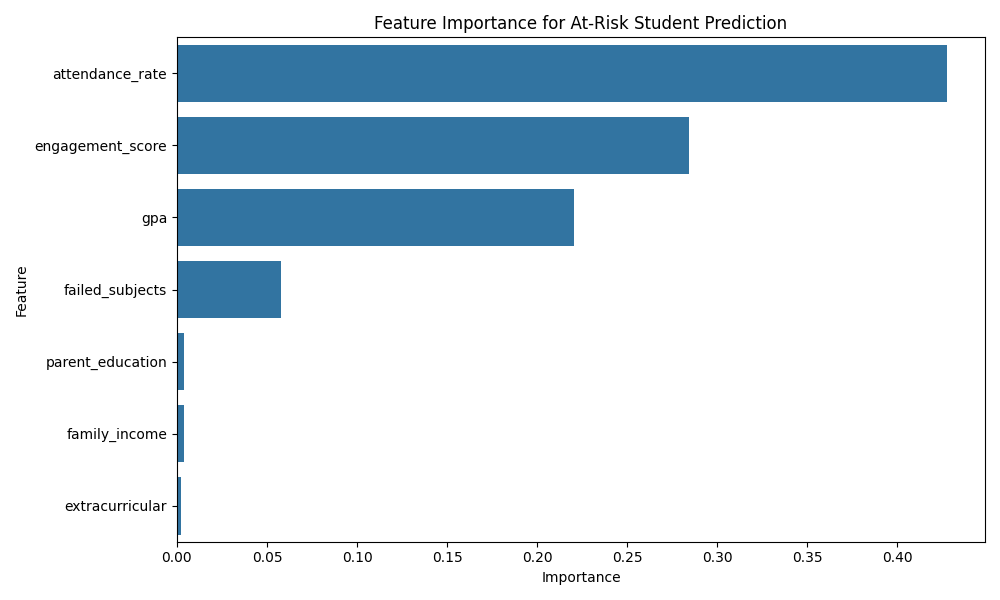

# Student Performance Predictor
Predictive model identifying at-risk students with 83% accuracy using academic and socioeconomic factors.

## Key Features
- SQL data integration
- Feature engineering (engagement score)
- Random Forest classification
- Interpretable feature importance

## Results
